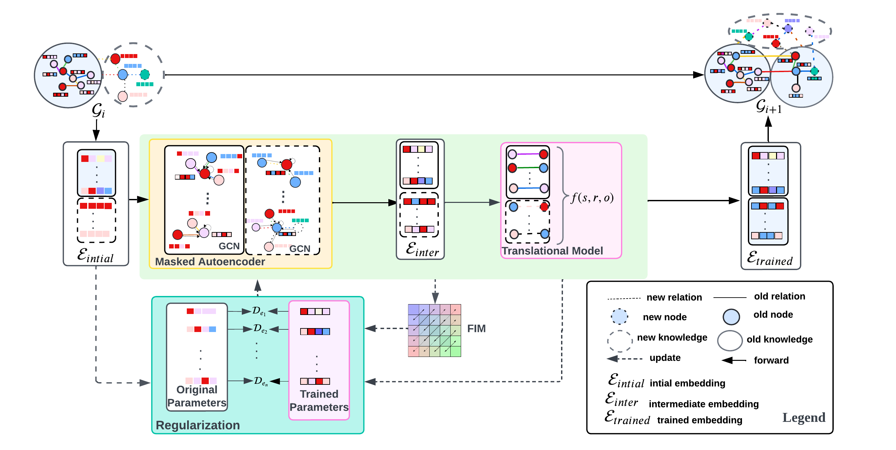

### Installation
Install PyTorch following the instructions on the [PyTorch](https://pytorch.org/).
Our code is written in Python3.

- pytorch=1.11.0
- pyg=2.0.4
- prettytable=3.3.0
- quadprog=0.1.11

### Model Overview


### Dataset
```
unzip dataset.zip
```

It will generate four dataset folders in the ./data directory. In our experiments, the datasets used are: `ENTITY`, `RELATION`, `FACT` and `HYBRID`.
In each dataset, there are five folders for five snapshots.


In our experiments, the four datasets used are: `ENTITY`, `RELATION`, `FACT` or `HYBRID`, different datasets have different regular weight and reconstructor weight
#### ENTITY
```
python main.py -dataset ENTITY -lifelong_name GKGEL -regular_weight 3.0 -reconstruct_weight 0.1 -using_embedding_transfer
```
#### RELATION
```
python main.py -dataset RELATION -lifelong_name GKGEL -regular_weight 0.09 -reconstruct_weight 0.1 -using_embedding_transfer
```
#### HYBRID
```
python main.py -dataset HYBRID -lifelong_name GKGEL -regular_weight 0.05 -reconstruct_weight 0.2 -using_embedding_transfer
```
#### FACT
```
python main.py -dataset FACT -lifelong_name GKGEL -regular_weight 0.04 -reconstruct_weight 0.7 -using_embedding_transfer
```

